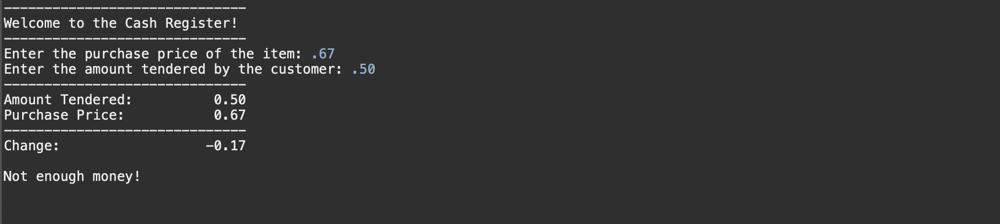
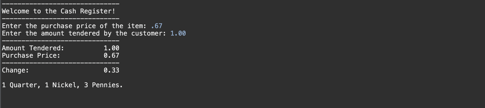
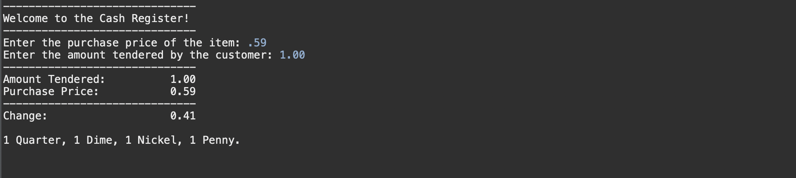
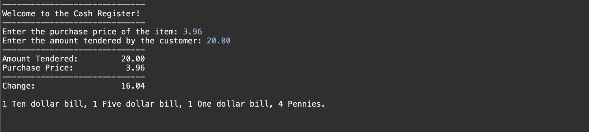
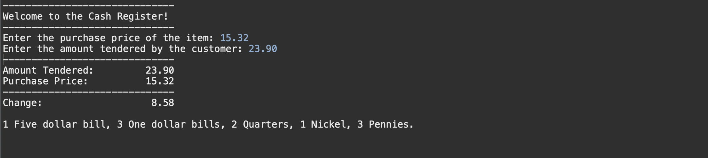

## Make Change Project

#### Description

- This is the 1st week homework assignment for Skill Distillery, Full Stack Development.


- This program simulates the operation of a cash register that makes change.


#### Technologies Used
	- JAVA
	- Eclipse
	- Git/GitHub
	- Sublime Text Editor
	- Zsh

#### Lessons Learned
    - Attention to detail, read and re-read requirements.
	- Commit early, commit often, and push!
	- A penny saved is a penny earned!
	- Format code, keep it separated (Indented)
	- Use of BigDecimal, and String builder
	
	- Over Engineered - K.I.S.S.
	
	
-

-

-

-

-

-

-

-

-

-

-

-

-

-

-

-

-

-

-

-

-

-

-

-

-

-

-

-

-

-

-

-

-

-

-

-

-

-

-

-

-

-

-

-

-

-

-

-

-

-

-

-

-

-

-

-

-

-

-

-

-

-

-

-

-

-

-

-

-

-

-

-

-

-

-

-

-

-

-

-

-

-

-

-

-

-

-

-

-

-

-

-

-

-

-

-

-

-

-

-

-

-

-

-

-

-

-

-

-

-

-

-

-

-

-

-

-

-

-

-

-

-

-

-

-

-

-

-

-

-

-

-

-

-

-

-

-

-

-

-

-

-

-

-

-

-

-

-

-

-

-

-

-

-

-

-

-

-

-

-

-

-

-

-

-

-

-

-

-

-

-

-

-

-

-

-

-

-

-

-

-

-

-

-

-

-

-

-

-

-

-

-

-

-

-

-

-
	
#### Additional learning 

#### Important notes about all the code in this Repository 

- Beyond the Homework - Additional files to help plan OOP learning ahead.
- I've created a separate package folder structure for possible future improvements
- Using previous knowledge and google searches, I'm slowly considering OOP fundamentals and how this application can be adapted for implementation along those lines.
- For this homework, MakeChange.java is the only relevant file.
- The concept of a CashRegister that accepts a future List<Purchases> and generates Change might be more towards where this project will head.
- I can't do it all right now, but I did want to start stubbing away code and thoughts for what I believe will be the eventual completion of an assignment like this.
- In addition to a possible models package, a utilities package is also created.
- Perhaps these utilities and models packages are ultimately how a CashRegister application will be fully structured into an OOP application.
- Some of the abstraction is not yet complete, and will be farmed into appropriate classes later.
- I envision a class called CashRegister, and Purchase, as well as a revised version of Change.
- The revised version of Change shall incorporate some of the ChangeFunctions as methods of itself, but much will need to be learned before all this is accomplished satisfactorily.
- Creating fully, well thought out OOP applications is as much of an art as it is a science and skill
- UML and DB Diagram lessons will be helpful to learn the official concepts and best practices
- OMG I'm actually loving this and glad to be a part of this class.
- I'm confident the material here is top notch and will be great for my future DIGITAL NOMAD goals.

#### How to run this program : This is a .java source code, command line project.  

You could open the project in an IDE and execute the main method using the IDE tools.

You can compile the project (.java) file on the command line, and then execute the compiled code.

The compilation and execution in the command line is subject to the proper working directory and installed JAVA Compiler and specific platform.

#### Compile the .java source file

```bash

javac MakeChange.java

```
#### Execute the compiled program.

```bash

java MakeChange

```

## Observation / Lesson Still To Learn

- I noticed that because the Project is structured to also include a package, compiling and executing the .java file as instructed above fails while in the appropriate (/workspace/MakeChange/src/com.skilldistillery.makechange/) folder on my system.
- I copied the .java file alone to an alternate location and removed the package declaration and was able to command line compile and execute.
- I believe the configuration of JAVA Packages as well as their compilation will be a future lesson in our coming weeks.  I may or may not investigate the solution to this on my own and simply wait for the appropriate time for this material to be presented.


## Project requirements


### Make Change (Cash Register)

### Overview

In the cash register we will calculate the amount of change returned to a customer based on the purchase price and the amount tendered. We will also notify the attendant how many of each type of currency ($20 ,$10 ,$5 ,$1, .25c, .10c, .05c, .01c) is needed to make the change for the customer. 

Change will be provided using a combination of the largest bill and coin denominations as possible. 

Denominations that are not used will not be displayed.

*Hint: Mod operator*

#### User Story #1

The user is prompted asking for the price of the item.

#### User Story #2

The user is then prompted asking how much money was tendered by the customer.

#### User Story #3

Display an appropriate message if the customer provided too little money or the exact amount.

#### User Story #4

If the amount tendered is more than the cost of the item, display the number of bills and coins that should be given to the customer. Denominations that are not used will not be displayed.

### Grading

This is a graded project. You are to have your project completed and pushed to Git by 0830 on Monday morning.  

If the code:
*  meets all stated requirements by the due date, you will receive 1 point.
*  meets most of the stated requirements by the due date, you may receive .5 point.
*  does not meet the stated requirements by the due date, you may receive 0 points.

Here are example test conditions:

* Amount: .67, Tendered: .50, Result: Error message
* Amount: .67, Tendered: 1.00, Result: 1 quarter, 1 nickel, 3 pennies.
* Amount: .59, Tendered: 1.00, Result: 1 quarter, 1 dime, 1 nickel, 1 penny.
* Amount: 3.96, Tendered: 20.00, Result: 1 ten dollar bill, 1 five dollar bill, 1 one dollar bill, 4 pennies.
* Amount: any amount less than 20.00, Tendered: anything greater than amount: correct denominations for correct change.

If the project receives 0 points, resubmission for potential partial credit may, at the discretion of the instructor, be granted. Ignored assignments are given 0 points with no possibility for resubmission.

To turn in a project, you must push it to a GitHub repository named **MakeChangeProject**.  You must include a `README.md` describing how to run your program.

<hr>

## The following screenshots represent example executions of the program and the results.







<hr>

[About The Developer](https://github.com/pasciaks/)

